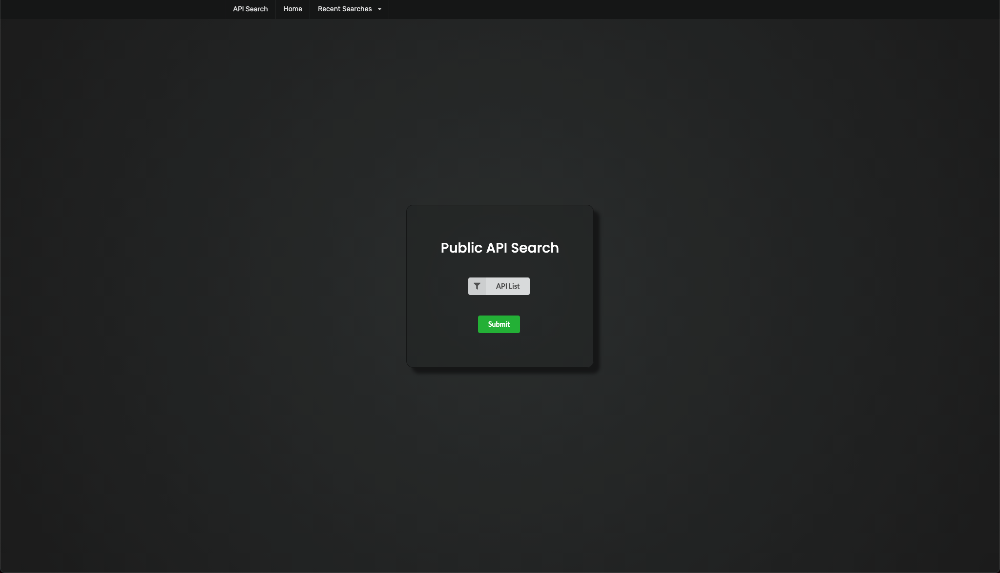
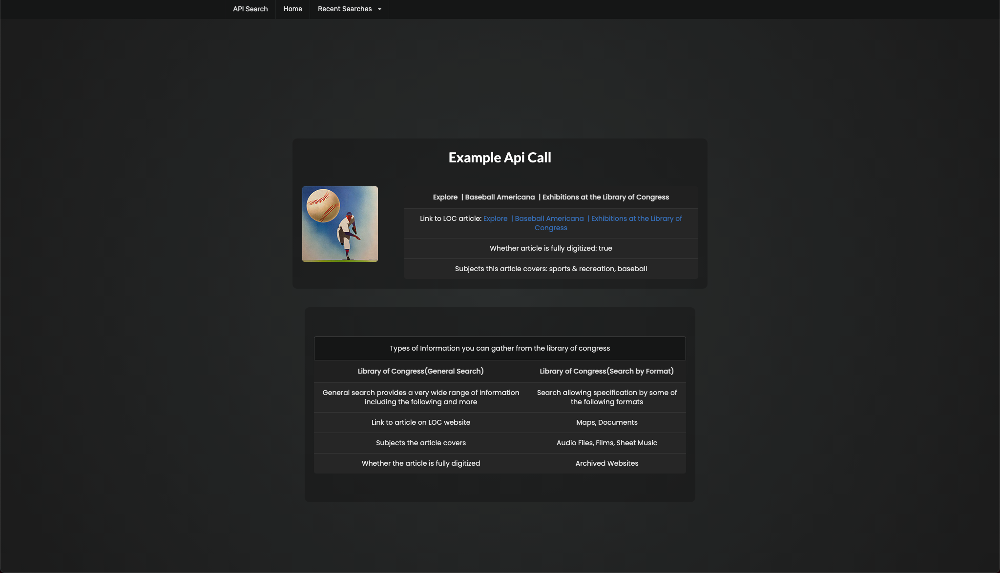

# public-api-search-mockup

## General Idea for this project
  What we would be doing here is creating a searchable group of apis. You would select an API and then submit the form. You would then be redirected to another page which will give you a list of useful information you could pull from that api in a nicely formatted page.
  The focus will be on no authentication APIs so nothing which requires an API key of any sort

## User Story
  AS A web developer
  I WANT to be able to quickly see useful information I can pull from APIs
  SO THAT I can more quickly determine if an API will be useful to me for my project

## wireframe/mockup 
Main page

Results

## APIs to be used 
At this point there will be a lot of APIs so I can't say specifically which ones

## Rough breakdown of tasks
1. We get the base pages set up more cleanly 
2. We start pulling info from 1 api and organizing it cleanly on the results page
3. We do the same for the rest of a category of APIs. pulling categories and APIs from [this](https://github.com/public-apis/public-apis) page
4. after we have a category fully functional we add more categories.
5. we can assing a category for each group memeber to work on so we can split up this work.